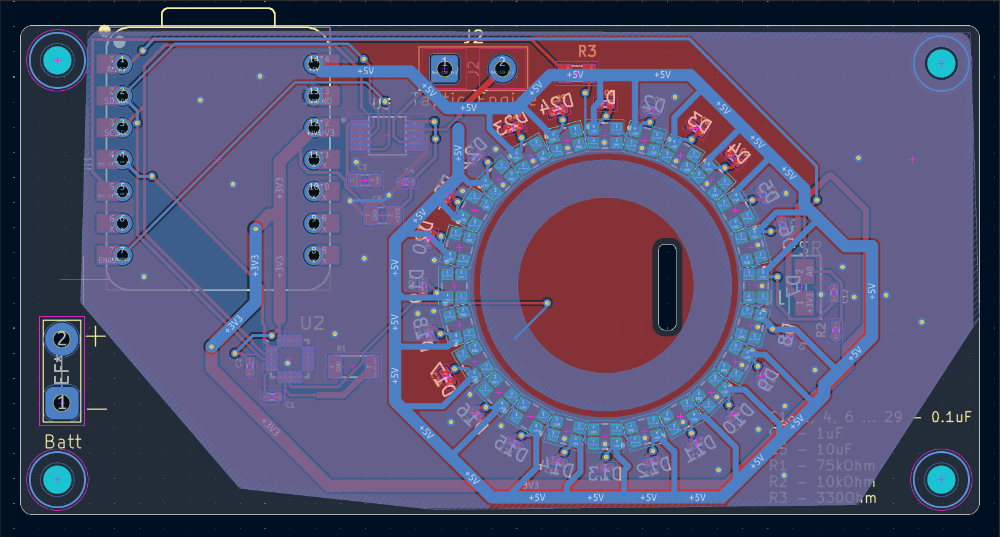

# HomeTap
A haptic button that connects to HomeAssistant

I always wanted a premium button that is simple and only does a few actions - Toggle the lights on and off and change the color of the LEDs in my room.

# Design
For the design, I used a very simple and minimalistic look, while looking sleek and modern.

It features a LED ring made out of 24 RGB LEDs that light up when the user's finger gets close to the button. This design is inspired from the prototype steam box.

# Schematic and PCB
This device features a custom pcb. I used [kicad](https://www.kicad.org/).

# Credits
This project uses:

[KICAD](https://www.kicad.org/)
[Blender](https://www.blender.org/) - For renders
[HackClub Fallout](fallout.hackclub.com) - Founding
